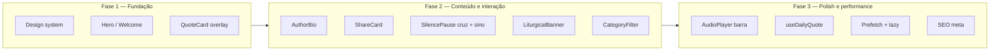
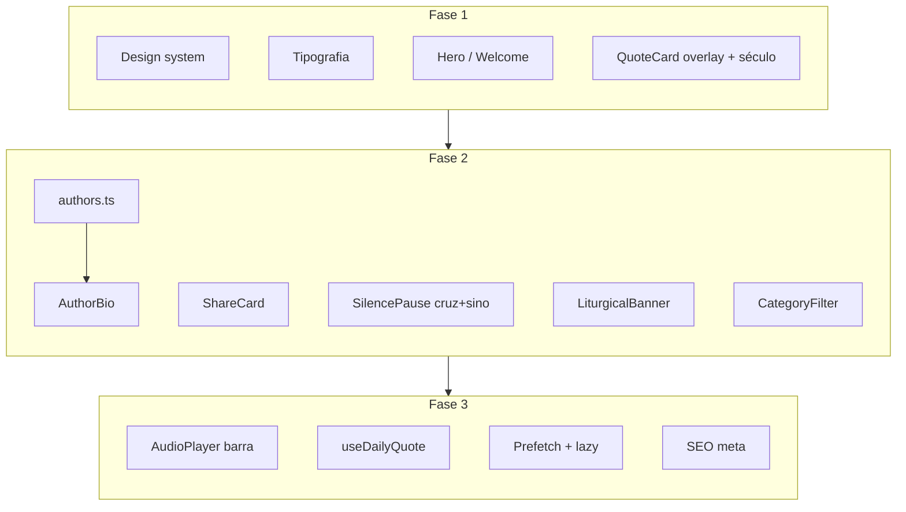

# Esquema de implementação — Melhorias SacrumScroll

Esquema para implementar as melhorias viáveis do documento "SacrumScroll Reimaginado", **sem quebrar** o projeto atual. Tudo incremental, em fases.

---

## Visão geral (3 fases)



---

## Fase 1 — Fundação (design e primeiros componentes)

Objetivo: unificar cores/fontes e melhorar a primeira impressão e o card.

| # | Tarefa | O que fazer | Risco |
|---|--------|-------------|--------|
| 1.1 | **Design system em variáveis** | Criar/ajustar `globals.css` com `--background`, `--foreground`, `--primary`, `--accent`, `--muted`, `--card` (HSL como no doc). Configurar Tailwind para usar essas variáveis. Manter nomes atuais (batina, dourado, etc.) como alias se necessário. | Baixo |
| 1.2 | **Tipografia** | Adicionar no layout: **Cinzel Decorative** (títulos/display), **Cormorant Garamond** (body). Manter EB Garamond para citações em itálico. Small-caps nos subtítulos com `font-variant: small-caps`. | Baixo |
| 1.3 | **WelcomeCard → Hero** | Melhorar o componente atual: parallax sutil no fundo (`useScroll` + `useTransform` do Framer Motion), seta animada (bounce) para “Deslize para começar”, título com Cinzel Decorative e letter-spacing. Não renomear arquivo ainda para evitar quebrar imports. | Baixo |
| 1.4 | **QuoteCard — overlay em gradiente** | No card, trocar overlay fixo por gradiente de baixo para cima: `linear-gradient(to top, background 0%, background/0.85 30%, background/0.4 70%, transparent 100%)` para legibilidade da citação. | Baixo |
| 1.5 | **QuoteCard — linha “Categoria · Século”** | Adicionar campo opcional `century` nas citações (ex. "Séc. IV"). No card, exibir acima da citação em small-caps: `Categoria · Século`. Onde não houver século, exibir só a categoria. | Baixo |

**Entregável Fase 1:** App com mesma funcionalidade, visual mais alinhado ao doc e Hero + cards mais refinados.

---

## Fase 2 — Conteúdo e interação

Objetivo: “Sobre o autor”, compartilhar, pausa mais rica, tempo litúrgico visível, filtro por categoria.

| # | Tarefa | O que fazer | Risco |
|---|--------|-------------|--------|
| 2.1 | **Dados dos autores** | Criar `src/data/authors.ts`: mapa `author → { name, shortBio, century?, category }`. Preencher para os autores do pool (Padres do Deserto, Agostinho, Teresa, Tomás, etc.). Usado pelo AuthorBio e pela linha “Categoria · Século”. | Baixo |
| 2.2 | **AuthorBio** | Componente modal ou drawer: ao clicar em “Sobre o autor” no card, abrir com nome, século, bio curta. Fechar com overlay ou botão. Não alterar estrutura do Feed. | Baixo |
| 2.3 | **ShareCard** | Botão “Compartilhar” no card. Usar `html2canvas` para gerar imagem (fundo escuro + citação + autor + “SacrumScroll”). Tamanho 1080x1080. Oferecer Web Share API no mobile; fallback download. Novo componente, sem mudar QuoteCard além do botão. | Médio |
| 2.4 | **SilencePause — cruz + sino** | Na tela de pausa de 30s (“Silêncio. Adore…”): (1) Cruz latina em SVG com animação de “desenho” (`stroke-dasharray` / `stroke-dashoffset` + Framer Motion). (2) Opção de tocar sino ao entrar; áudio só após gesto do usuário (ex. “Tocar sino”) para evitar bloqueio de autoplay. | Baixo |
| 2.5 | **LiturgicalBanner** | Componente fino no topo (ou logo abaixo do header): exibe o tempo litúrgico atual (Advento, Natal, Quaresma, Páscoa, Tempo Comum) com cor/ícone. Consumir a mesma lógica que já define `data-season` no layout. Opcional: link para “Oração do dia”. | Baixo |
| 2.6 | **CategoryFilter** | Filtro (chips ou dropdown): Patrística, Escolástica, Mística, Liturgia, Escritura. O Feed já tem `category` em cada item; filtrar os itens exibidos por categoria selecionada. “Todos” como padrão. Estado no cliente (useState ou query param). | Baixo |

**Entregável Fase 2:** Usuário pode ver bio do autor, compartilhar card como imagem, ver pausa com cruz animada e (opcional) sino, ver tempo litúrgico e filtrar por categoria.

---

## Fase 3 — Polish e performance

Objetivo: player visível, citação do dia, carregamento mais suave, SEO.

| # | Tarefa | O que fazer | Risco |
|---|--------|-------------|--------|
| 3.1 | **AudioPlayer — barra fixa** | Manter MusicContext; criar componente `AudioPlayer` (barra no topo ou no rodapé): play/pause, volume, trocar faixa (skip). Semi-transparente, não atrapalhar o scroll. Reutilizar `music-pool` e lógica atual. | Baixo |
| 3.2 | **useDailyQuote** | Hook `useDailyQuote()`: a partir da data (dia do ano) e do tempo litúrgico, devolve uma citação “do dia”. Opção A: exibir no topo do feed (um card fixo “Citação do dia”). Opção B: seção separada ou aba. Não substituir o feed infinito. | Baixo |
| 3.3 | **Prefetch da próxima imagem** | No Feed, quando o card em vista estiver por volta de 50% visível, disparar prefetch da imagem do próximo card (se houver). Reduz atraso ao rolar. | Baixo |
| 3.4 | **Lazy loading de imagens** | Garantir `loading="lazy"` nas imagens dos cards; placeholder (blur ou cor sólida) até carregar. Já existe algo próximo; padronizar. | Baixo |
| 3.5 | **SEO e meta tags** | Em `app/layout.tsx` e na página principal: título “SacrumScroll — O Feed da Tradição Católica”, description, og:image, twitter card. Favicon e manifest já existem. | Baixo |
| 3.6 | **Haptic ao favoritar (opcional)** | Ao curtir/favoritar, chamar `navigator.vibrate?.(10)` se existir. Envolver em try/catch e checagem de suporte. | Baixo |

**Entregável Fase 3:** Player sempre visível, citação do dia disponível, rolagem mais fluida, melhor descoberta no Google e redes sociais.

---

## O que fica de fora (por enquanto)

| Item | Motivo |
|------|--------|
| Virtualização (react-window) | Só introduzir se o feed tiver 50+ cards no DOM e performance piorar. Hoje o carregamento por blocos pode ser suficiente. |
| Renomear em massa (HeroSection, ScrollFeed, Index, quotes.ts) | Alto risco de quebrar imports; ganho é só nominal. Evoluir no lugar. |
| Mudar para Pages Router | Projeto é App Router; migração desnecessária e arriscada. |
| Lovable Cloud / backend | Manter como “futuro”; favoritos e estado continuam em localStorage. |
| Autoplay de sino na SilencePause | Políticas dos browsers bloqueiam; sino só após gesto do usuário. |

---

## Ordem sugerida de implementação (checklist)

```text
Fase 1
[x] 1.1 Design system (variáveis CSS + Tailwind)
[x] 1.2 Tipografia (Cinzel Decorative, Cormorant Garamond, small-caps)
[x] 1.3 WelcomeCard: parallax + seta animada + título
[x] 1.4 QuoteCard: overlay em gradiente
[x] 1.5 QuoteCard: linha Categoria · Século (campo century opcional)

Fase 2
[x] 2.1 authors.ts (dados dos autores)
[x] 2.2 AuthorBio (modal/drawer)
[x] 2.3 ShareCard (html2canvas + Web Share API)
[x] 2.4 SilencePause: cruz SVG animada + sino (com botão)
[x] 2.5 LiturgicalBanner
[x] 2.6 CategoryFilter

Fase 3
[x] 3.1 AudioPlayer (barra fixa)
[x] 3.2 useDailyQuote + exibição “Citação do dia”
[x] 3.3 Prefetch próxima imagem
[x] 3.4 Lazy loading padronizado
[x] 3.5 SEO / meta tags
[x] 3.6 Haptic ao favoritar (opcional)
```

**Status: implementação concluída.**

---

## Resumo visual



Implementar na ordem das fases reduz risco e permite testar cada passo sem quebrar o projeto.
